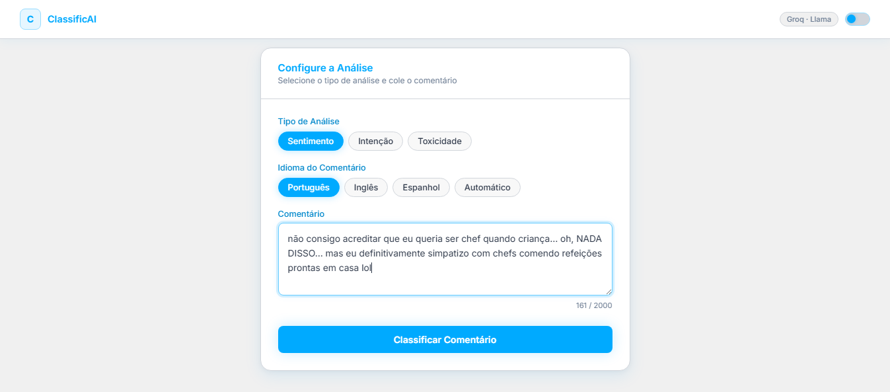
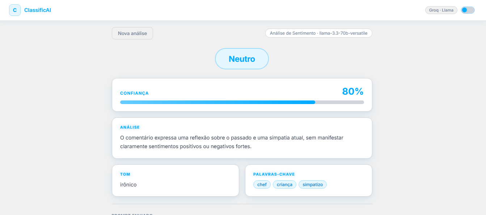

# Classificador de Comentários

Classifica comentários por **sentimento**, **intenção** ou **toxicidade** usando a API do Groq (Llama 3).

## Screenshots





## Pré-requisitos

- Python 3.9+
- Chave de API do Groq: [console.groq.com](https://console.groq.com)

## Instalação

**1. Entre na pasta do projeto:**
```bash
cd classificador-comentarios
```

**2. Crie o ambiente virtual:**

Windows:
```cmd
python -m venv venv
venv\Scripts\activate
```

Linux / macOS:
```bash
python3 -m venv venv
source venv/bin/activate
```

**3. Instale as dependências:**
```bash
pip install -r requirements.txt
```

## Configuração

**Windows (cmd):**
```cmd
set GROQ_API_KEY=sua_chave_aqui
```

**Windows (PowerShell):**
```powershell
$env:GROQ_API_KEY="sua_chave_aqui"
```

**Linux / macOS:**
```bash
export GROQ_API_KEY=sua_chave_aqui
```

## Executar

```bash
python src/main.py
```

Acesse em: `http://localhost:5001`


## Como usar

1. Selecione o **Tipo de Análise**:
   - **Sentimento** — Positivo / Negativo / Neutro / Misto
   - **Intenção** — Elogio / Reclamação / Sugestão / Dúvida / Spam
   - **Toxicidade** — Seguro / Levemente Ofensivo / Ofensivo / Muito Ofensivo

2. Selecione o **Idioma** do comentário (Português, Inglês, Espanhol ou Automático).

3. Cole ou digite o comentário no campo de texto (até 2000 caracteres).

4. Clique em **Classificar Comentário**.

## Resultado

- **Badge** com a classificação e cor correspondente
- **Barra de confiança** de 0 a 100%
- **Análise** com justificativa da classificação
- **Tom** detectado no texto
- **Palavras-chave** relevantes

## Modelos utilizados (em ordem de prioridade)

1. `llama-3.3-70b-versatile`
2. `llama-3.1-8b-instant` *(fallback)*

Em caso de rate limit, o sistema troca automaticamente para o próximo modelo.

## Estrutura

```
classificador-comentarios/
├── requirements.txt
└── src/
    ├── main.py          # backend Flask + lógica de classificação
    └── static/
        └── index.html   # interface web
```
